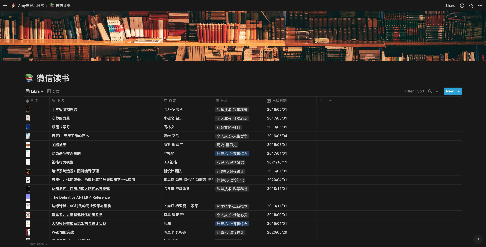

# weread

生成微信读书数据列表的 csv 文件，作为数据源导入 notion，更好的图书管理

# getting started

```sh
git clone https://github.com/hufeng/weread.git
cd weread
pnpm i # npm install or yarn
node weread.mjs
```

# notion

1. 扫描二维码

   

2. notion 导入 csv
   
